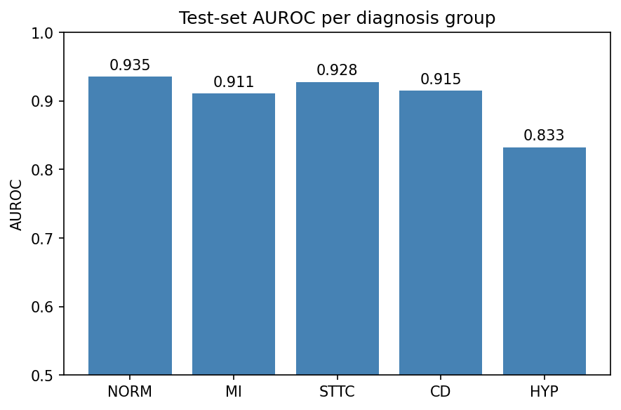
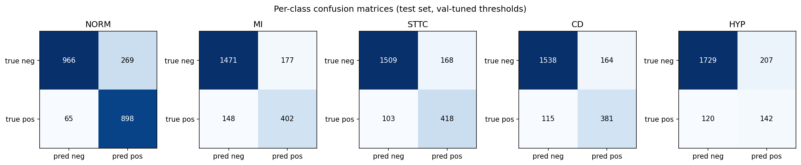
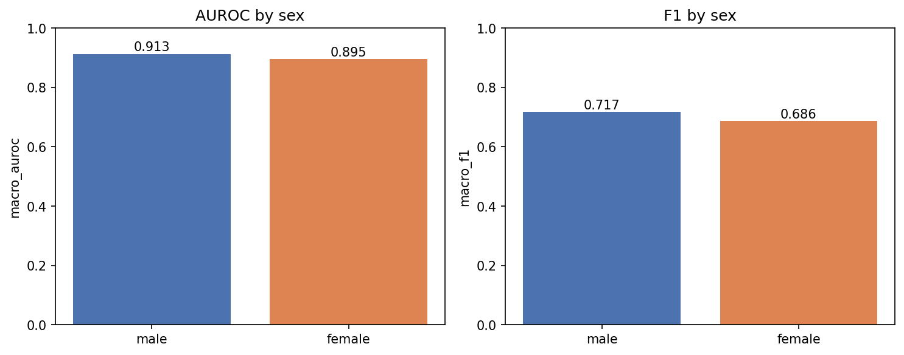
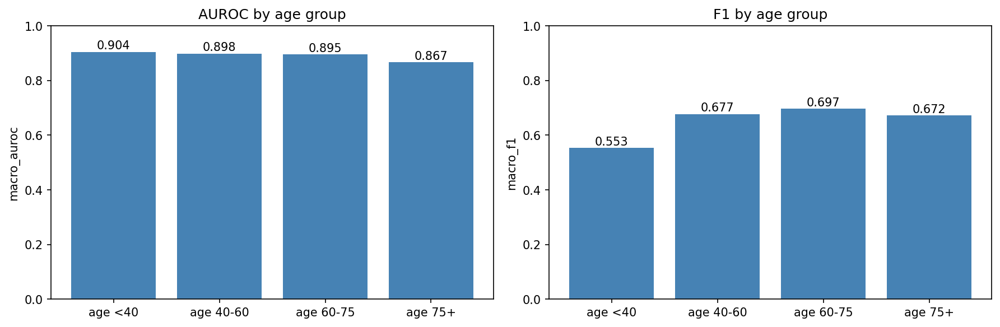

# ECG Diagnostic Classification Using Time-Frequency Representations

## Problem Statement

Advancements in the field of health-tech have led to ECG screening powered by ML, that can catch cardiac conditions that would otherwise go undiagnosed until an emergency event, making large-scale preventive cardiology increasingly feasible. The best current classification models work
directly on the raw voltage signal. But an ECG also carries information in how
its frequency content changes over the course of a heartbeat, like the sharpness
of a QRS peak or the energy distribution across frequency bands, and standard
models have no reason to look for that structure unless it is given to them. One
way to surface it is to convert the signal into a spectrogram, a 2D image of
time versus frequency, and classify that image with a convolutional neural
network, the same architecture used in medical imaging. 

This project classifies 12-lead ECG recordings from the PTB-XL dataset into five diagnostic superclasses (NORM, MI, STTC, CD, HYP) and audits performance variation across patient sex and age groups. The pipeline runs as a numbered sequence of scripts (EDA → preprocessing → training → inspection → fairness → demo) and ships with a Streamlit app for single-recording inference.
Most published PTB-XL work reports a single aggregate AUROC; this project additionally benchmarks a 1D-CNN baseline, evaluates per-class performance at val-tuned decision thresholds, and measures subgroup performance across sex and age via a dedicated fairness audit.

Future aims: Another way is to extract known spectral features directly from the signal. It is unknown whether either approach improves over the raw-signal baseline, whether combining them adds
anything, and whether the answer changes depending on the cardiac condition or
the quality of the recording. This project will test that on the PTB-XL dataset, and
separately asks how much accuracy survives when the models are compressed for
deployment in settings where patient data cannot leave the premises.


---

## What's Different About This Project

- **Subgroup fairness analysis.** Every metric is recomputed separately for male vs. female patients and for four age bands (<40, 40–60, 60–75, 75+) using val-tuned thresholds.
- **Threshold-aware evaluation.** Per-class decision thresholds are tuned on the validation fold via an F1-argmax sweep over 0.05–0.95 (step 0.01). F1, precision, recall, and confusion matrices are all reported at those thresholds rather than only threshold-free AUROC.

---

## Data

### Source

PTB-XL v1.0.3 from PhysioNet: https://physionet.org/content/ptb-xl/1.0.3/

The loader reads `ptbxl_database.csv` and `scp_statements.csv`, retains only SCP-ECG codes with `diagnostic == 1`, and maps each recording to its list of diagnostic superclasses via the `diagnostic_class` column.

### Download

```bash
bash scripts/download_data.sh
```

The loader expects 100 Hz WFDB records under `data/physionet.org/files/ptb-xl/1.0.3/records100/` (and `records500/` for 500 Hz).

### Labels (five superclasses)

`NORM`, `MI`, `STTC`, `CD`, `HYP`, produced by `build_diagnosis_matrix` via `sklearn.preprocessing.MultiLabelBinarizer` with that fixed class order, so `class_names.txt` always matches the column order of `y_*.npy`. A single recording can carry multiple labels — this is a multi-label task.

### Train / Validation / Test Splits

PTB-XL ships with a `strat_fold` column (1–10). `split_by_fold` uses folds 1–8 for training, fold 9 for validation, and fold 10 for the held-out test. Both fold numbers are exposed as keyword arguments (`val_fold=9`, `test_fold=10`) on the pipeline call.

---

## Project Structure

```text
ecg-feature-detection/
├── src/
│   ├── paths.py        # DATASET, PROCESSED, REPORTS, MLRUNS + per-stage dirs
│   ├── loader.py       # load_metadata / add_diagnostic_labels / load_raw_signals
│   ├── preprocess.py   # keep_patients_with_recordings / clean_ecg_signals /
│   │                   # build_diagnosis_matrix / split_by_fold
│   └── model.py        # ECGNet (1D-CNN)
├── scripts/
│   ├── 01_eda.py
│   ├── 02_preprocess.py
│   ├── 03_train.py
│   ├── 04_inspect.py
│   ├── 05_fairness.py
│   ├── 06_app.py
│   └── download_data.sh
├── configs/
├── docs/
├── notebooks/
├── tests/
├── reports/
│   ├── eda/            # per-stage PNGs + CSVs from 01_eda.py
│   ├── preprocess/     # pipeline_dag.png from 02_preprocess.py
│   ├── train/          # best_model.pt, thresholds.json, report.txt
│   ├── inspect/        # metrics_per_class.csv, confusion matrices, etc.
│   └── fairness/       # subgroup_metrics.csv, metrics_by_sex/age.png
├── artifacts/
├── mlruns/             # MLflow store (file:///…/mlruns)
├── requirements.txt
└── README.md
```

All per-stage output directories (`PROCESSED`, `EDA`, `PREPROCESS`, `TRAIN`, `INSPECT`, `FAIRNESS`) are created automatically at import time by `src/paths.py`.

---

## Pipeline Visualization

The pipeline DAG is generated by the [`pipefunc`](https://github.com/pipefunc/pipefunc) library at runtime rather than maintained as a static diagram.

- `scripts/01_eda.py` calls `pipeline.visualize()` to render the EDA DAG inline.
- `scripts/02_preprocess.py` calls `pipeline.visualize_graphviz(filename=REPORT_FOLDER / "pipeline_dag.png")` and falls back to `pipeline.visualize()` if the system Graphviz binary is absent.

The canonical committed diagram is `reports/preprocess/pipeline_dag.png`, regenerated whenever `python scripts/02_preprocess.py` is executed. Dependencies: system Graphviz (`apt-get install graphviz` / `brew install graphviz`) plus `pip install "pipefunc[all]"`.


---

## Pipeline — File-by-File

### `scripts/01_eda.py` — Exploratory Data Analysis

Assembles `load_metadata → add_diagnostic_labels → keep_patients_with_recordings` plus seven `@pipefunc` EDA stages into a `pipefunc.Pipeline(profile=True)` and executes the full graph via `pipeline("eda_summary", dataset_folder=DATASET_FOLDER)`. Stages: class counts, unlabelled-patient count, lead-I preview of the first three patients, label-cardinality distribution, per-fold diagnosis distribution, reference ECG plots (one per superclass and all 12 leads of the first patient), and a sanity check on 100 random recordings (NaNs, min/max voltage, quietest-lead std).

**Outputs in `reports/eda/`:**

- `class_counts.csv`, `01_class_counts.png`
- `02_lead_I_first_three.png`
- `labels_per_record.csv`
- `per_fold_distribution.csv`, `03_per_fold_distribution.png`
- `04_one_record_per_superclass.png`, `05_all_12_leads.png`
- `eda_summary.txt`

### `scripts/02_preprocess.py` — Preprocessing

Builds the full `pipefunc.Pipeline` (`load_metadata → add_diagnostic_labels → keep_patients_with_recordings → load_raw_signals → clean_ecg_signals → build_diagnosis_matrix → split_by_fold`), renders the DAG to `reports/preprocess/pipeline_dag.png`, executes it at 100 Hz with `val_fold=9` / `test_fold=10`, and serialises the splits. Signal cleaning applies a 3rd-order Butterworth bandpass (0.5–40 Hz) followed by per-lead z-scoring. Labels are produced by `MultiLabelBinarizer` over the fixed class list `["NORM","MI","STTC","CD","HYP"]`.

**Reads:** `ptbxl_database.csv`, `scp_statements.csv`, `records100/*.hea+.dat`  
**Writes to `PROCESSED`:** `X_train.npy`, `y_train.npy`, `X_val.npy`, `y_val.npy`, `X_test.npy`, `y_test.npy`, `class_names.txt`  
**Writes to `reports/preprocess/`:** `pipeline_dag.png`

### `scripts/03_train.py` — Training (with MLflow)

Loads the `.npy` splits, permutes axes to `(batch, 12, time)`, and trains `ECGNet` for 10 epochs with `BCEWithLogitsLoss` + per-class `pos_weight = neg/pos`, Adam (`lr=1e-3`, `weight_decay=1e-4`), batch size 128, gradient clipping at norm 5.0, and seed 0. The best checkpoint is selected by validation macro-AUROC, then reloaded to tune per-class decision thresholds on the validation set via an F1-argmax sweep over `np.arange(0.05, 0.96, 0.01)`. Test metrics are computed on the best checkpoint using the tuned thresholds.

MLflow is configured with `set_tracking_uri("file:///…/mlruns")` and `set_experiment("ptbxl_baseline_cnn")`. The `baseline-cnn` run logs all hyperparameters, split sizes, `class_names.json`, per-epoch `train_loss` / `val_loss` / `val_macro_auroc`, final test metrics, per-class test AUROC, the `thresholds.json` and `report.txt` artifacts, and the trained PyTorch model with an input example.

**Outputs in `reports/train/`:** `best_model.pt`, `thresholds.json`, `report.txt`

### `scripts/04_inspect.py` — Model Inspection

Loads `best_model.pt` and `thresholds.json` (falls back to 0.5 per class if absent), runs batched sigmoid inference on the test fold, and writes per-class AUROC/F1/precision/recall/support plus a `macro` row. Also renders a per-class AUROC bar chart, a grid of per-class 2×2 confusion matrices at val-tuned thresholds, a prediction co-occurrence matrix, a 20-row prediction CSV, and a gallery of three exact-match and three mismatch examples plotted on lead II (z-scored).

**Outputs in `reports/inspect/`:** `metrics_per_class.csv`, `per_class_auroc.png`, `confusion_matrices.png`, `pred_cooccurrence.csv`, `predictions_head.csv`, `patient_{n:02d}_idx{idx}.png` gallery

### `scripts/05_fairness.py` — Fairness Audit

Rebuilds the test-fold metadata by calling the pipefunc nodes directly (`load_metadata.func → add_diagnostic_labels.func → keep_patients_with_recordings.func`), asserts row alignment with `X_test`, and runs inference at the val-tuned thresholds. Patients are binned into `male` (sex==0), `female` (sex==1), and four age bands (`<40`, `40-60`, `60-75`, `75+`) via `pd.cut(age, bins=[-0.1, 40, 60, 75, 200])`. For each group the script reports macro and per-class AUROC/F1/precision/recall.

**Outputs in `reports/fairness/`:** `subgroup_metrics.csv`, `metrics_by_sex.png`, `metrics_by_age.png`

### `scripts/06_app.py` — Streamlit Demo

Caches the test-set arrays and the `ECGNet` checkpoint, and exposes three input modes via a sidebar radio: **Browse test set** (select a row from `X_test.npy` / `y_test.npy`), **Upload WFDB record** (paired `.hea` + `.dat`, resampled to 100 Hz and truncated to 1000 samples), and **Upload .npy (1000×12)** (raw float array, re-cleaned with the same 0.5–40 Hz bandpass + z-score as training). A sidebar slider exposes a global decision threshold (default 0.5) that overrides the val-tuned thresholds for interactive exploration.

The main pane displays predicted vs. true labels (when available), a per-class probability bar chart, and the 12-lead signal laid out in a 6×2 grid. A fairness panel at the bottom renders `auroc_by_sex.png`, `auroc_by_age.png`, and `subgroup_metrics.csv` from `reports/fairness/` when they exist.

### `src/` — Shared Library

- **`src/paths.py`** — centralises `DATASET`, `PROCESSED`, `REPORTS`, `MLRUNS`, and per-stage dirs (`EDA`, `PREPROCESS`, `TRAIN`, `INSPECT`, `FAIRNESS`); auto-creates every output folder on import.
- **`src/loader.py`** — `load_metadata` parses `ptbxl_database.csv` (with `ast.literal_eval` on `scp_codes`); `add_diagnostic_labels` joins against `scp_statements.csv` filtered by `diagnostic == 1`; `load_raw_signals` reads WFDB records from `filename_lr` (100 Hz) or `filename_hr` (500 Hz).
- **`src/preprocess.py`** — `keep_patients_with_recordings`, `clean_ecg_signals` (3rd-order Butterworth 0.5–40 Hz + per-lead z-score), `build_diagnosis_matrix` (multi-label binariser with fixed class order), `split_by_fold`.
- **`src/model.py`** — `ECGNet`: three `Conv1d(k=7, pad=3) → BatchNorm1d → ReLU → MaxPool1d(2)` blocks with channels `(32, 64, 128)`, followed by `AdaptiveAvgPool1d(1)` and a `Linear(128, n_classes)` head; input shape `(batch, 12, time)`, output shape `(batch, 5)` logits.

---

## MLflow Experiment Tracking

Training runs are stored in the local MLflow store under `mlruns/`, experiment `ptbxl_baseline_cnn`, run name `baseline-cnn`. Each run logs: hyperparameters (`batch_size=128`, `epochs=10`, `learning_rate=1e-3`, `weight_decay=1e-4`, `channels="32-64-128"`, `sampling_rate=100`, `loss="BCEWithLogitsLoss+pos_weight"`, `optimiser="Adam"`, `seed=0`), split sizes, `class_names.json`, per-epoch metrics, final test metrics, per-class test AUROC, the `thresholds.json` and `report.txt` artifacts, and the trained PyTorch model with an input example.

```bash
mlflow ui --backend-store-uri ./mlruns
```

---

## Streamlit Demo

### Launch

```bash
streamlit run scripts/06_app.py
```

`reports/train/best_model.pt` and `data/processed/{X_test.npy, y_test.npy, class_names.txt}` must exist before launching the app. Run `02_preprocess.py` and `03_train.py` first.

### Intended Use

Research demonstration only — not a medical device and must not be used to inform clinical decisions.

---

## Evaluation

- **Primary metric:** macro-averaged AUROC across the five superclasses on the held-out test fold (fold 10).
- **Per-class metrics at tuned thresholds:** AUROC, F1, precision, recall, support, plus a `macro` row — in `reports/inspect/metrics_per_class.csv`.
- **Confusion matrices:** one 2×2 per class at val-tuned thresholds — `reports/inspect/confusion_matrices.png`.
- **Subgroup metrics:** macro + per-class AUROC/F1/precision/recall per subgroup — `reports/fairness/subgroup_metrics.csv`.

---

## Results

### Overall (test set, fold 10)

- Best validation macro-AUROC: **0.9062**
- Test macro-AUROC: **0.9043**

Per-class test metrics at val-tuned thresholds:

| Class     | Threshold | AUROC      | F1     | Precision | Recall | Support |
|-----------|-----------|------------|--------|-----------|--------|---------|
| NORM      | 0.31      | 0.9353     | 0.8432 | 0.7695    | 0.9325 | 963     |
| MI        | 0.81      | 0.9111     | 0.7121 | 0.6943    | 0.7309 | 550     |
| STTC      | 0.68      | 0.9279     | 0.7552 | 0.7133    | 0.8023 | 521     |
| CD        | 0.62      | 0.9146     | 0.7320 | 0.6991    | 0.7681 | 496     |
| HYP       | 0.67      | 0.8325     | 0.4648 | 0.4069    | 0.5420 | 262     |
| **macro** | —         | **0.9043** | **0.7015** | **0.6566** | **0.7552** | 2792 |




### Subgroup Performance

| Group      | n    | Macro AUROC | Macro F1 | Macro Precision | Macro Recall |
|------------|------|-------------|----------|-----------------|--------------|
| male       | 1132 | 0.913       | 0.717    | 0.677           | 0.762        |
| female     | 1066 | 0.895       | 0.686    | 0.638           | 0.748        |
| age <40    | 310  | 0.904       | 0.553    | 0.590           | 0.531        |
| age 40–60  | 657  | 0.898       | 0.677    | 0.655           | 0.701        |
| age 60–75  | 723  | 0.895       | 0.697    | 0.652           | 0.752        |
| age 75+    | 474  | 0.867       | 0.672    | 0.596           | 0.784        |




---

## How to Run

### 1. Clone and install

```bash
git clone https://github.com/ParitMehta/ecg-feature-detection.git
cd ecg-feature-detection
python -m venv .venv
source .venv/bin/activate
pip install -r requirements.txt
```

For pipeline DAG export in `02_preprocess.py`, the system Graphviz binary is also required (`apt-get install graphviz` / `brew install graphviz`) along with `pip install "pipefunc[all]"`.

### 2. Download the data

```bash
bash scripts/download_data.sh
```

Places PTB-XL v1.0.3 under the path expected by `src/paths.py` (`DATASET = data/physionet.org/files/ptb-xl/1.0.3`).

### 3. Run the pipeline in order

```bash
python scripts/01_eda.py
python scripts/02_preprocess.py
python scripts/03_train.py
python scripts/04_inspect.py
python scripts/05_fairness.py
streamlit run scripts/06_app.py
```

Each step depends on outputs produced by the previous one.

---

## Limitations

- Research only — not a medical device.
- PTB-XL was collected at a single German institution; results may not generalise to other populations or recording hardware.
- Model outputs are raw sigmoid probabilities, not calibrated probabilities.
- Subgroup performance varies across sex and age groups; any deployment consideration must first address the gaps documented in `reports/fairness/subgroup_metrics.csv`.
