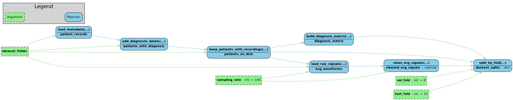

# Electrocardiography (ECG) Diagnostic Classification Using Time-Frequency Representations

## Problem Statement

An introductory guide to ECG is available here: https://www.biopac.com/wp-content/uploads/ECG-Guide.pdf 

Advancements in the field of health-tech have led to ECG screening powered by machine learning, that can catch cardiac conditions that would otherwise go undiagnosed until an emergency event, making large-scale preventive cardiology increasingly feasible. The best current classification models work directly on the raw voltage signal. But an ECG also carries information in how its frequency content changes over the course of a heartbeat, like the sharpness of a QRS peak or the energy distribution across frequency bands, and standard models have no reason to look for that structure unless it is given to them. One way to surface it is to convert the signal into a spectrogram, a 2D image of time versus frequency, and classify that image with a convolutional neural network, the same architecture used in medical imaging.

This project classifies 12-lead ECG recordings from the PTB-XL dataset into five diagnostic superclasses (NORM, MI, STTC, CD, HYP) and audits performance variation across patient sex and age groups. The pipeline runs as a numbered sequence of scripts (EDA → preprocessing → training → inspection → fairness → demo) and ships with a Streamlit app for single-recording inference. Most published PTB-XL work reports a single aggregate AUROC (explainer: https://www.evidentlyai.com/classification-metrics/explain-roc-curve); this project additionally benchmarks a 1D-CNN baseline, evaluates per-class performance at val-tuned decision thresholds, and measures subgroup performance across sex and age via a dedicated fairness audit.

Future aims: Another way is to extract known spectral features directly from the signal. It is unknown whether either approach improves over the raw-signal baseline, whether combining them adds anything, and whether the answer changes depending on the cardiac condition or the quality of the recording. This project will test that on the PTB-XL dataset, and separately asks how much accuracy survives when the models are compressed for deployment in settings where patient data cannot leave the premises.

---

## What's Different About This Project

- **Subgroup fairness analysis.** Every metric is recomputed separately for male vs. female patients and for four age bands (<40, 40–60, 60–75, 75+) using val-tuned thresholds.
- **Threshold-aware evaluation.** Per-class decision thresholds are tuned on the validation fold via an F1-argmax sweep over 0.05–0.95 (step 0.01). F1, precision, recall, and confusion matrices are all reported at those thresholds rather than only threshold-free AUROC.

---

## Quick Start

### Step 1 : Clone the repo

```bash
git clone https://github.com/ParitMehta/ecg-feature-detection.git
cd ecg-feature-detection
```

### Step 2 : Download the data

```bash
bash scripts/download_data.sh
```

Places PTB-XL v1.0.3 under `data/physionet.org/files/ptb-xl/1.0.3/` as expected by `src/paths.py`.

### Step 3 : Run the pipeline

These steps must be run in order. Each step reads from the outputs of the previous one.

```bash
python scripts/01_eda.py
python scripts/02_preprocess.py
python scripts/03_train.py
python scripts/04_inspect.py
python scripts/05_fairness.py
```

> For the optional pipeline DAG export in `02_preprocess.py`, a system Graphviz binary
> is required: `apt-get install graphviz` (Debian/Ubuntu) or `brew install graphviz` (macOS).

**Minimum required for the demo:** `02_preprocess.py` and `03_train.py` must have been
run before launching the Streamlit app. If you skip `04_inspect.py` or `05_fairness.py`,
the app will still work but the fairness panel at the bottom of the UI will be blank.
It only populates when `reports/fairness/` plots exist.

### Step 4 : Launch the demo

---

#### Option A : Docker (recommended)

No Python environment needed on the host. Both the API and the Streamlit app start with one command.

```bash
docker compose up
```

| Service | Port | What it serves |
|---|---|---|
| `ecg-api` (FastAPI) | 8000 | ECGNet inference endpoint (`/predict`) |
| `ecg-app` (Streamlit) | 8501 | Browser UI |

Open **http://localhost:8501** in your browser. API docs at **http://localhost:8000/docs**.

**Rebuild after code changes:**

```bash
docker compose build --no-cache
docker compose up
```

**Stop:**

```bash
docker compose down
```

---

#### Option B : Local (no Docker)

First create and activate an environment, then install dependencies.

**Using venv (Python built-in):**

```bash
python -m venv .venv
source .venv/bin/activate            # on Windows: .venv\Scripts\activate
pip install -r requirements.txt
```

**Using conda:**

```bash
conda create -n ecg-env python=3.12
conda activate ecg-env
pip install -r requirements.txt
```

Then start the API and the app in two separate terminals:

```bash
# Terminal 1 : model API
uvicorn api.main:app --host 0.0.0.0 --port 8000

# Terminal 2 : Streamlit frontend
streamlit run scripts/ECG_Classifier.py
```

Open **http://localhost:8501** in your browser.

---

## Data

### Source

PTB-XL v1.0.3 from PhysioNet: [https://physionet.org/content/ptb-xl/1.0.3/](https://physionet.org/content/ptb-xl/1.0.3/)

The loader reads `ptbxl_database.csv` and `scp_statements.csv`, retains only SCP-ECG codes with `diagnostic == 1`, and maps each recording to its list of diagnostic superclasses via the `diagnostic_class` column. The loader expects 100 Hz WFDB records under `data/physionet.org/files/ptb-xl/1.0.3/records100/` (and `records500/` for 500 Hz).

### Labels (five superclasses)

`NORM`, `MI`, `STTC`, `CD`, `HYP`, produced by `build_diagnosis_matrix` via `sklearn.preprocessing.MultiLabelBinarizer` with that fixed class order, so `class_names.txt` always matches the column order of `y_*.npy`. A single recording can carry multiple labels, as this is a multi-label task.

### Train / Validation / Test Splits

PTB-XL ships with a `strat_fold` column (1–10). `split_by_fold` uses folds 1–8 for training, fold 9 for validation, and fold 10 for the held-out test. Both fold numbers are exposed as keyword arguments (`val_fold=9`, `test_fold=10`) on the pipeline call.

---

## Project Structure

```text
ecg-feature-detection/
├── src/
│   ├── __init__.py
│   ├── paths.py        # DATASET, PROCESSED, REPORTS, MLRUNS + per-stage dirs
│   ├── loader.py       # load_metadata / add_diagnostic_labels / load_raw_signals
│   ├── preprocess.py   # keep_patients_with_recordings / clean_ecg_signals /
│   │                   # build_diagnosis_matrix / split_by_fold
│   └── model.py        # ECGNet (1D-CNN)
├── scripts/
│   ├── 01_eda.py
│   ├── 02_preprocess.py
│   ├── 03_train.py
│   ├── 04_inspect.py
│   ├── 05_fairness.py
│   ├── ECG_Classifier.py       # Streamlit frontend (calls API)
│   ├── download_data.sh
│   └── pages/
│       └── 01_Overview.py      # Overview + GDPR page (Streamlit multipage)
├── api/
│   └── main.py                 # FastAPI backend
├── configs/
├── docs/
├── notebooks/
├── tests/
├── reports/
│   ├── eda/            # per-stage PNGs + CSVs from 01_eda.py
│   ├── preprocess/     # pipeline_dag.png from 02_preprocess.py
│   ├── train/          # best_model.pt, thresholds.json, report.txt
│   ├── inspect/        # metrics_per_class.csv, confusion matrices, etc.
│   └── fairness/       # subgroup_metrics.csv, metrics_by_sex/age.png
├── artifacts/
├── mlruns/             # MLflow store (file:///…/mlruns)
├── Dockerfile.api
├── Dockerfile.app
├── docker-compose.yml
├── requirements.txt
└── README.md
```

All per-stage output directories are created automatically at import time by `src/paths.py`.

---

## Pipeline Visualization

The pipeline DAG is generated by the [`pipefunc`](https://github.com/pipefunc/pipefunc) library at runtime rather than maintained as a static diagram.

- `scripts/01_eda.py` calls `pipeline.visualize()` to render the EDA DAG inline.
- `scripts/02_preprocess.py` calls `pipeline.visualize_graphviz(filename=REPORT_FOLDER / "pipeline_dag.png")` and falls back to `pipeline.visualize()` if the system Graphviz binary is absent.

The canonical committed diagram is `reports/preprocess/pipeline_dag.png`, regenerated whenever `python scripts/02_preprocess.py` is executed.



---

## Pipeline : File-by-File

The pipeline is split into six numbered scripts that must be run in order. Each script is self-contained: it reads from the outputs of the previous step and writes its own outputs to a dedicated subfolder under `reports/`.

---

### `scripts/01_eda.py` : Exploratory Data Analysis

**Purpose:** Understand the dataset before touching it... class balance, label overlap, signal quality, and how recordings are distributed across the ten folds.

```bash
python scripts/01_eda.py
```

**What it does:**

- Counts recordings per diagnostic class and flags any recordings with no diagnostic label
- Plots lead-I waveforms for the first three patients
- Shows how many labels each recording carries (some recordings have more than one diagnosis)
- Plots the class distribution across all ten folds to verify stratification
- Exports one representative ECG per superclass and a full 12-lead plot for the first patient
- Runs a sanity check on 100 random recordings: checks for NaNs, voltage range, and whether any lead is near-silent

**Outputs in `reports/eda/`:**

| File | Description |
|---|---|
| `class_counts.csv` / `01_class_counts.png` | Recording count per superclass |
| `02_lead_I_first_three.png` | Lead-I waveforms for patients 1–3 |
| `labels_per_record.csv` | Label-cardinality distribution |
| `per_fold_distribution.csv` / `03_per_fold_distribution.png` | Class balance across folds |
| `04_one_record_per_superclass.png` | One representative ECG per class |
| `05_all_12_leads.png` | All 12 leads of the first patient |
| `eda_summary.txt` | Plain-text summary of all findings |

---

### `scripts/02_preprocess.py` : Preprocessing

**Purpose:** Convert the raw WFDB recordings into clean NumPy arrays that the model can train on, and produce the train/validation/test split files.

```bash
python scripts/02_preprocess.py
```

**What it does:**

1. Loads metadata and filters out recordings with no diagnostic label
2. Reads the raw 100 Hz ECG signals from disk
3. Cleans each signal with a 3rd-order Butterworth bandpass filter (0.5–40 Hz) to remove baseline wander and high-frequency noise, then z-scores each lead independently
4. Converts the SCP-ECG diagnostic codes into a binary label matrix (`NORM`, `MI`, `STTC`, `CD`, `HYP`), one column per class
5. Splits recordings into train (folds 1–8), validation (fold 9), and test (fold 10)
6. Saves each split as `.npy` files ready for training

Also renders the full pipeline as a DAG diagram at `reports/preprocess/pipeline_dag.png`.

**Writes to `data/processed/`:**

`X_train.npy`, `y_train.npy`, `X_val.npy`, `y_val.npy`, `X_test.npy`, `y_test.npy`, `class_names.txt`

---

### `scripts/03_train.py` : Training

**Purpose:** Train the 1D-CNN (`ECGNet`) on the preprocessed splits, select the best checkpoint, tune per-class decision thresholds on the validation set, and evaluate on the held-out test fold.

```bash
python scripts/03_train.py
```

**What it does:**

1. Trains `ECGNet` for 10 epochs using binary cross-entropy loss with per-class positive-weight correction to handle class imbalance
2. Saves the checkpoint with the highest validation macro-AUROC as `best_model.pt`
3. Tunes a separate decision threshold for each class on the validation set by sweeping over thresholds from 0.05 to 0.95 and selecting the one that maximises F1 : this matters because a fixed 0.5 threshold performs poorly on imbalanced classes like HYP
4. Evaluates the best checkpoint on the test fold using the tuned thresholds
5. Logs all hyperparameters, metrics, and artifacts to MLflow

**Outputs in `reports/train/`:**

| File | Description |
|---|---|
| `best_model.pt` | Saved model weights |
| `thresholds.json` | Val-tuned decision threshold per class |
| `report.txt` | Best val AUROC, test AUROC, and per-class AUROC |

---

### `scripts/04_inspect.py` : Model Inspection

**Purpose:** Produce a detailed breakdown of model performance on the test set, i.e. per-class metrics, confusion matrices, and concrete examples of correct and incorrect predictions.

```bash
python scripts/04_inspect.py
```

**What it does:**

1. Loads the trained model and the val-tuned thresholds from `reports/train/`
2. Runs inference on the full test fold
3. Reports AUROC, F1, precision, recall, and support for each class individually, plus macro averages
4. Renders a 2×2 confusion matrix for each class at its tuned threshold
5. Exports a co-occurrence matrix showing which pairs of classes are predicted together
6. Saves a gallery of six example patients, i.e. three correct, three incorrect, plotted on lead II

**Outputs in `reports/inspect/`:**

| File | Description |
|---|---|
| `metrics_per_class.csv` | AUROC/F1/precision/recall/support per class |
| `per_class_auroc.png` | Bar chart of per-class AUROC |
| `confusion_matrices.png` | 2×2 confusion matrix per class |
| `pred_cooccurrence.csv` | Prediction co-occurrence counts |
| `predictions_head.csv` | First 20 rows of predicted vs. true labels |
| `patient_XX_idxYYYY.png` | Example correct / incorrect patient plots |

---

### `scripts/05_fairness.py` : Fairness Audit

**Purpose:** Check whether the model performs equally well across demographic groups.

```bash
python scripts/05_fairness.py
```

**What it does:**

1. Reconstructs the test-fold patient metadata (sex, age) and aligns it with `X_test`
2. Bins patients into six subgroups: male, female, and four age bands (<40, 40–60, 60–75, 75+)
3. Runs inference at the val-tuned thresholds and reports macro and per-class AUROC/F1/precision/recall for each subgroup separately

**Outputs in `reports/fairness/`:**

| File | Description |
|---|---|
| `subgroup_metrics.csv` | Full macro + per-class metrics for every subgroup |
| `metrics_by_sex.png` | Metric comparison: male vs. female |
| `metrics_by_age.png` | Metric comparison across the four age bands |

---

### `scripts/ECG_Classifier.py` : Streamlit Demo

**Purpose:** Interactive browser interface for exploring model predictions on individual ECG recordings.

The model is served via `api/main.py` (FastAPI). The Streamlit app never loads `ECGNet` directly.

**Three input modes (sidebar radio):**

| Mode | What to provide |
|---|---|
| Browse test set | Select any row from the preprocessed test split by index |
| Upload WFDB record | Upload a paired `.hea` + `.dat` file from the PTB-XL dataset |
| Upload .npy array | Upload a raw `(1000, 12)` float array |

The main pane shows predicted vs. true labels, a per-class probability bar chart, and all 12 leads in a 6×2 grid. Per-class sidebar sliders default to the val-tuned thresholds from `thresholds.json` and can be adjusted for live exploration. A fairness panel at the bottom displays the sex and age breakdown plots from `reports/fairness/` if they exist.

### `scripts/pages/01_Overview.py` : Overview Page

Streamlit multipage script for the **Project Overview** page, written for non-technical readers (e.g. medical students). It appears in the Streamlit sidebar automatically when `ECG_Classifier.py` is running.

Covers: the PTB-XL dataset, the five diagnostic superclasses, train/val/test split setup, 1D-CNN intuition, threshold sliders, how to interpret AUROC/F1/fairness plots, limitations, and a GDPR notice.

---

### `src/` : Shared Library

These files are imported by the pipeline scripts and do not need to be run directly.

- **`paths.py`** — Defines where everything lives on disk. All output folders are created automatically at import time.
- **`loader.py`** — Reads PTB-XL files from disk: metadata, diagnostic code reference table, and raw ECG signals.
- **`preprocess.py`** — Signal cleaning, normalisation, label matrix construction, and train/val/test splitting.
- **`model.py`** — Defines the neural network (`ECGNet`). See architecture below.

#### Model Architecture

`ECGNet` is a 1D convolutional neural network that takes a 10-second, 12-lead ECG as input and outputs a probability for each of the five diagnostic classes.

- **1D convolutions** operate along the time axis, detecting local waveform patterns (e.g. a QRS complex) across all 12 leads at once.
- **Three convolutional blocks** progressively increase filters (32 → 64 → 128) while halving time resolution via max-pooling.
- **Global average pooling** collapses the time axis into a 128-dimensional vector, making the model robust to slight differences in recording length.
- **Five independent outputs**, one logit per class, so a recording can be positive for any combination simultaneously.

```text
Input → (batch, 12 leads, 1000 time steps @ 100 Hz)
│
▼
Block 1: Conv1d → BatchNorm → ReLU → MaxPool → (batch, 32, 500)
Block 2: Conv1d → BatchNorm → ReLU → MaxPool → (batch, 64, 250)
Block 3: Conv1d → BatchNorm → ReLU → MaxPool → (batch, 128, 125)
│
▼
GlobalAvgPool → (batch, 128)
Linear → (batch, 5 logits)
│
▼
Output → sigmoid → probability per class
```

---

## MLflow Experiment Tracking

MLflow records every training run automatically: hyperparameters, loss curves, and final metrics. The results are reproducible and comparable across runs.

```bash
mlflow ui --backend-store-uri ./mlruns
# then open http://localhost:5000
```

Everything logged per run:

- All training hyperparameters (learning rate, batch size, etc.)
- Loss and AUROC at every epoch, for both training and validation sets
- Final test AUROC overall and per class
- The saved model weights and the val-tuned thresholds file

---

## Evaluation

- **Primary metric:** macro-averaged AUROC across the five superclasses on the held-out test fold (fold 10).
- **Per-class metrics at tuned thresholds:** AUROC, F1, precision, recall, support, plus a `macro` row, saved in `reports/inspect/metrics_per_class.csv`.
- **Confusion matrices:** one 2×2 per class at val-tuned thresholds. Saved as `reports/inspect/confusion_matrices.png`.
- **Subgroup metrics:** macro + per-class AUROC/F1/precision/recall per subgroup. Saved as `reports/fairness/subgroup_metrics.csv`.

Full results are viewable interactively in the Streamlit app.

---

## Limitations

- Research only, not a medical device.
- PTB-XL was collected at a single German institution; results may not generalise to other populations or recording hardware.
- Model outputs are raw sigmoid probabilities, not calibrated probabilities.
- Subgroup performance varies across sex and age groups; any deployment consideration must first address the gaps documented in `reports/fairness/subgroup_metrics.csv`.
